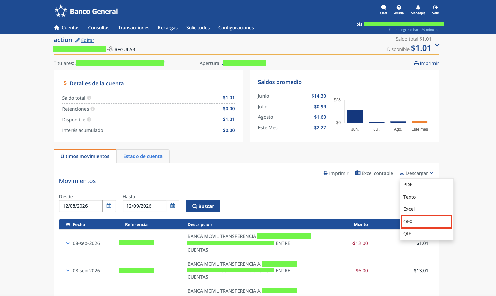

<p align="center">
  
</p>

# gatorFinance

<p align="center">
  
</p>

Análisis financiero local para macOS a partir de tus archivos OFX.

Importa estados de cuenta, corrige la categorización, revisa el flujo de caja mensual y guarda reportes financieros `gatorHealth` diseñados para proteger tu privacidad, sin conectar una cuenta bancaria ni subir tu historial de transacciones.

> **Alpha:** verifica las cifras importantes directamente con tus estados de cuenta. `gatorHealth` es una señal orientativa, no asesoría financiera.

## Tabla de contenidos

* [¿Qué hace?](#qué-hace)
* [Instalación](#instalación)
* [Uso](#uso)
* [¿Qué puedes hacer con gatorFinance?](#qué-puedes-hacer-con-gatorfinance)
* [Privacidad](#privacidad)
* [Detalles técnicos](#detalles-técnicos)
* [Desarrollo](#desarrollo)
* [Contribuciones](#contribuciones)
* [Licencia](#licencia)

## ¿Qué hace?

* Importa uno o varios estados de cuenta OFX mediante el selector de archivos o arrastrándolos a la aplicación.
* Almacena los importes monetarios como unidades menores enteras dentro de una base de datos SQLite local.
* Previsualiza cada importación OFX antes de escribirla en la base de datos y la asigna a un perfil de cuenta persistente.
* Deduplica los identificadores de transacción proporcionados por el banco dentro de cada cuenta, omite reimportaciones idénticas y conserva como conflictos aquellas cuyo contenido haya cambiado.
* Admite varias cuentas del mismo banco, incluso cuando comparten los mismos últimos cuatro dígitos visibles.
* Mantiene los paneles y reportes limitados a una cuenta o moneda a la vez.
* Normaliza los nombres de comercios y categoriza créditos y débitos mediante reglas inspeccionables.
* Conserva las modificaciones manuales de categoría, comercio, nota, etiquetas y exclusión del puntaje.
* Excluye las transferencias internas del cálculo de ingresos, gastos y `gatorHealth`.
* Muestra el flujo neto mensual, los componentes del puntaje y los totales de gastos por categoría.
* Guarda reportes resumidos estrictos en formato `.gatorfinance.json` dentro de la ubicación común de salida de AOS.
* Permite copiar, mostrar en Finder, importar y mover reportes guardados a la Papelera desde **Library**.
* Muestra una vista previa exacta del resumen diseñado para proteger tu privacidad antes de abrir ChatGPT o Claude.
* Permite cambiar toda la interfaz entre inglés y español sin reiniciar la aplicación.
* Incluye temas persistentes oscuro, claro y del sistema, además de un selector rápido en el encabezado.
* Permite guardar **Smart Lists** deterministas según comercio o fuente de ingresos, dirección de la transacción, cuenta, categoría, etiqueta, fecha y rango de importes.
* Detecta el almacenamiento beta anterior ubicado en `~/.gatorfinance/db`, pero nunca lo importa automáticamente.

## Instalación

### Como pasar información desde Banco General

Este app fue hecho para simplificar la búsqueda de transacciones y poder hacer análisis de tus gastos a lo largo del tiempo.
Actualmente NO cuenta con ningún enlace MCP o API. Este app NO se conecta al Internet y no recibe información automaticamente.
Fue diseñado de manera simple con la información que ya esta disponible.

Para proporcionar datos, solamente tienes que acceder a tu portal de Banca en Linea, seleccionar el rango de fechas, oprimir cargar, y luego seleccionar la opción de descargar en formato .OFX

Si puedes añadir varias cuentas que tengas y al app reconocerá las diferentes cuentas y te notificará si hay duplicados para asegurar que la información siempre se mantenga coherente.

**OJO: Si tienes una cuenta de ahorros, aún así el mismo sistema de Banco General lo escribe como si fuera CHECKING/CORRIENTE. Al importar el .OFX te dirá como si es CHECKING/CORRIENTE. El app da la opción de colocar SAVINGS/AHORRO y cualquier nombre especial que le tengas a esa cuenta para fácilmente reconocer y organizar.**


<p align="center">
  
</p>

### Alpha para macOS

**Requiere:** macOS 12 o posterior. La compilación universal es compatible con Macs Apple Silicon e Intel.

1. Descarga [gatorFinance 0.4.0-alpha.4](https://github.com/alman-os/gatorFinance-collab/releases/download/v0.4.0-alpha.4/gatorFinance_0.4.0-alpha.4_macOS-universal_notarized.dmg).
2. Abre el DMG y arrastra `gatorFinance` a Aplicaciones.
3. Abre `gatorFinance` y selecciona uno o varios archivos `.ofx`.

El DMG de la versión está firmado con Developer ID, notarizado y grapado (*stapled*). Junto a él se publica un checksum:

```bash
cd ~/Downloads
shasum -a 256 -c gatorFinance_0.4.0-alpha.4_macOS-universal_notarized.dmg.sha256
```

**No se encuentra la descarga:** los artefactos alpha aparecen en la [página de Releases](https://github.com/alman-os/gatorFinance/releases) cuando son publicados. Mientras tanto, puedes compilar la aplicación desde el código fuente.

**No se importaron transacciones:** confirma que el archivo exportado sea OFX y no CSV, QFX, PDF o una página HTML descargada desde el portal del banco.

**Datos de una beta anterior:** durante el primer inicio, gatorFinance detecta `~/.gatorfinance/db` y lo deja intacto. Importa nuevamente tus archivos OFX actuales para crear un registro limpio; los datos beta nunca se restauran automáticamente.

### Compilar desde el código fuente

Instala Node.js 22+, pnpm, Rust estable y las herramientas de línea de comandos de Xcode.

```bash
git clone https://github.com/alman-os/gatorFinance-collab.git
cd gatorFinance-collab
pnpm install
pnpm tauri dev
```

## Uso

1. Haz clic en **Import OFX** o arrastra tus estados de cuenta a la ventana.
2. Confirma el perfil de cuenta cuando se detecte una cuenta nueva. Las exportaciones posteriores con la misma identidad OFX se asignarán automáticamente.
3. Usa el selector de cuentas para ver una sola cuenta o todas las cuentas de la moneda seleccionada.
4. Revisa el puntaje, flujo neto mensual, componentes del puntaje y totales por categoría dentro de **Overview**.
5. Abre **Transactions** para buscar dentro del registro o corregir una categoría, comercio, nota, etiquetas o exclusión del puntaje.
6. Abre **Smart Lists** para guardar una vista dinámica basada en reglas, como débitos de Amazon durante este año o créditos provenientes de un pagador específico.
7. Regresa a **Overview** y haz clic en **Save Report**.
8. Usa **Library** para inspeccionar, copiar, mostrar en Finder, importar, compartir o mover un reporte a la Papelera.

### Identidad de cuentas e importaciones repetidas

gatorFinance identifica las cuentas mediante una huella digital versionada compuesta por la institución y el identificador OFX completo de la cuenta. La interfaz únicamente muestra el sufijo enmascarado. La primera importación crea un perfil con nombre; la misma cuenta será reconocida en importaciones posteriores incluso si el perfil cambia de nombre.

Dentro de cada perfil, `FITID` representa el identificador de transacción proporcionado por el proveedor. El importador lo compara con una segunda huella digital del contenido construida a partir del importe firmado en unidades menores, la fecha, referencia y memo:

* el mismo `FITID` con el mismo contenido se identifica como una transacción ya importada;
* el mismo `FITID` con contenido modificado se conserva como un conflicto y no sobrescribe el registro;
* el mismo `FITID` dentro de una cuenta diferente se considera una transacción independiente.

Cada importación genera un recibo, incluso cuando el archivo contiene únicamente duplicados. Los archivos que no incluyen una identidad de cuenta confiable requieren que selecciones una cuenta explícitamente.

### Smart Lists

Las **Smart Lists** utilizan reglas inspeccionables y no llaman a ningún servicio de IA. La coincidencia de fuentes ignora mayúsculas, minúsculas y acentos, y permite buscar mediante coincidencia parcial, exacta o por inicio de texto.

Los filtros opcionales incluyen dirección crédito/débito, perfiles de cuenta, categoría, etiqueta, fechas y rango de importes. Las listas se actualizan automáticamente cuando nuevas transacciones importadas coinciden con las reglas guardadas.

### Biblioteca de reportes

Los reportes que pueden compartirse se guardan en:

```text
~/Documents/AOS/gatorFi
```
